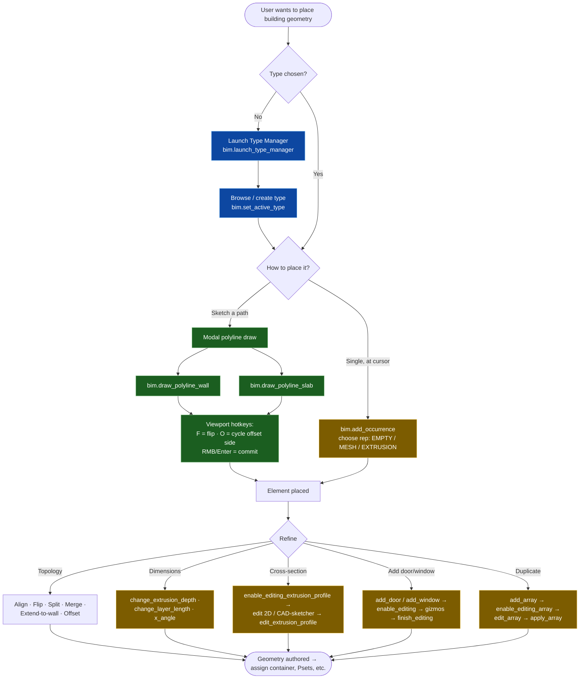
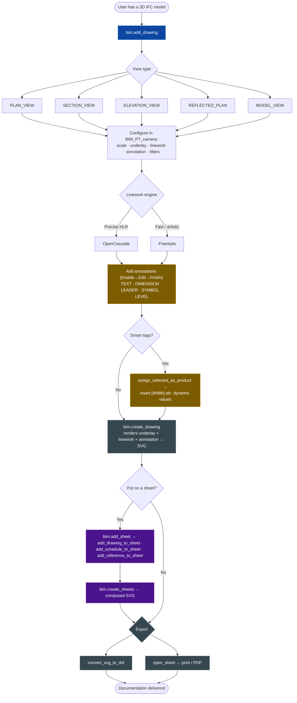
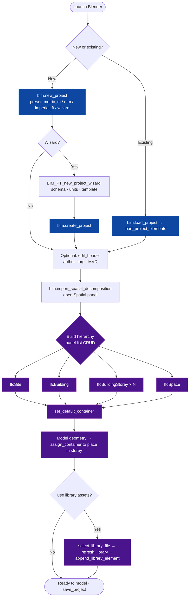
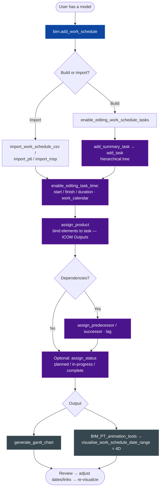

# Bonsai (IfcOpenShell) — User-Flow Diagrams of Existing Tools

> Decision-oriented user flows for prominent **non-civil** Bonsai tools, built
> to compare interaction patterns against the Civil 3D alignment flows
> (`Civil3D_Alignment_UserFlows.md`). Grounded in the actual operators/panels
> in `src/bonsai/bonsai/bim/module/{model,type,drawing,project,spatial,sequence}`.
>
> **Color = interaction pattern** (not feature status), so you can see which
> patterns recur across Bonsai:
> 🟦 Entry point · 🟩 Modal viewport draw · 🟨 Enable→Edit→Finish param loop ·
> 🟪 List/panel CRUD · ⬜ Generate/export

---

## Recurring Bonsai interaction patterns (the cheat sheet)

Before the diagrams — four patterns show up over and over. Worth naming them,
because the Civil 3D comparison is really a comparison of *these*:

1. **🟦 Type-first authoring** — you pick/define a *Type* (IfcWallType…) before
   you place an *occurrence*. Geometry is an instance of a reusable type.
2. **🟩 Modal polyline draw** — a modal operator captures clicks in the viewport
   with hotkeys (F=flip, O=offset side), then commits geometry.
3. **🟨 Enable → Edit → Finish/Cancel** — the universal parametric edit loop.
   `enable_editing_X` (loads gizmos/panel) → edit → `finish_editing_X` (writes
   to IFC) or `cancel_editing_X` (revert). Doors, windows, stairs, roofs,
   railings, arrays, text — all identical.
4. **🟪 Panel list CRUD** — a panel holds a list (schedules, sheets, drawings,
   cost items, tasks, containers) with add/remove/load/expand buttons.

---

## 1. Geometry Authoring (model + type) — closest analog to alignment layout

**Compare to Civil 3D:** the structure is strikingly close to the Alignment
Layout Tools flow — *choose a kind of thing → draw it interactively → enter an
edit loop*. Two big differences: (a) Bonsai is **type-first** (you instance a
reusable type; Civil 3D alignments are not type-based), and (b) Bonsai's
edit loop is the **Enable→Edit→Finish gizmo pattern** rather than C3D's
fixed/floating/free constraint solver. Bonsai has *no equivalent of the
constraint-based geometry model* — its parametrics are per-object, not
inter-entity tangency. That's the gap Saikei's PI editing already starts to
close on the civil side.

---

## 2. Drawing / Documentation — the deliverable workflow

**Compare to Civil 3D:** this is Bonsai's analog to C3D's plan/profile sheet
production. Same shape: *define a view → configure → annotate → generate →
compose on sheet → export*. The annotation step reuses the Enable→Edit→Finish
pattern, and the dynamic-value tags (`[Width]`) mirror C3D's label expressions.

---

## 3. Project Setup + Spatial Structure — the "before you model" flow

**Compare to Civil 3D:** C3D has no real equivalent of this spatial-container
setup — its "project" is a DWG with a drawing template, and elements live in a
flat object model, not an IfcSite→Building→Storey tree. This is a place where
Bonsai's IFC-native model is *richer* than C3D's, and it's the structure
Saikei's alignments/surfaces ultimately get parented into.

---

## 4. 4D Sequencing — a downstream data workflow

**Compare to Civil 3D:** the closest C3D analog is its data/quantity-takeoff
and material reporting, but C3D has no native 4D. This flow shows Bonsai's
**data-binding pattern** — author a structured list, then *assign model
elements to it* (task↔product). The same pattern drives the cost module
(cost-item↔quantity↔product). Civil deliverables (earthwork volumes, quantity
takeoff) would plug into exactly this binding model.

---

## 5. What this means for the Saikei comparison

| Pattern | Civil 3D alignment | Bonsai existing | Saikei today |
|---|---|---|---|
| Pick a kind of thing first | command per geometry type | **Type-first** (instance a Type) | command per op (PI method) |
| Interactive viewport draw | layout toolbar clicks | **Modal polyline** (F/O hotkeys) | PI picker (modal) ✅ |
| Parametric edit loop | fixed/floating/free constraints | **Enable→Edit→Finish gizmos** | PI grip edit (G key) ✅ |
| Tabular editor | Grid View / sub-entity | property panels + lists | ⬜ (gap) |
| List/CRUD management | Prospector tree | **Panel list CRUD** | partial |
| Data binding to model | quantity takeoff | **task/cost ↔ product** | earthwork Qto (one-way) |

**The actionable read:** if Saikei wants to feel native to Bonsai rather than
like a C3D port, the two patterns to lean into are **(1) the Enable→Edit→Finish
gizmo loop** (which Saikei's PI edit mode already echoes) and **(2) panel list
CRUD** for managing multiple alignments/profiles. Civil 3D's *fixed/floating/
free constraint model* has **no precedent anywhere in Bonsai** — so adopting it
would be net-new UX for the whole ecosystem. Worth flagging to Dion as a
deliberate choice: emulate C3D's constraint power, or stay with Bonsai's
lighter gizmo-based parametrics?

---

## Sources (Bonsai code, this repo)
- `src/bonsai/bonsai/bim/module/model/{operator,ui}.py`
- `src/bonsai/bonsai/bim/module/type/{operator,ui}.py`
- `src/bonsai/bonsai/bim/module/drawing/{operator,ui}.py`
- `src/bonsai/bonsai/bim/module/project/{operator,ui}.py`
- `src/bonsai/bonsai/bim/module/spatial/{operator,ui}.py`
- `src/bonsai/bonsai/bim/module/sequence/{operator,ui}.py`
