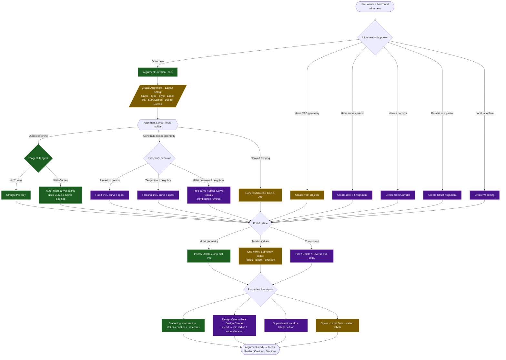
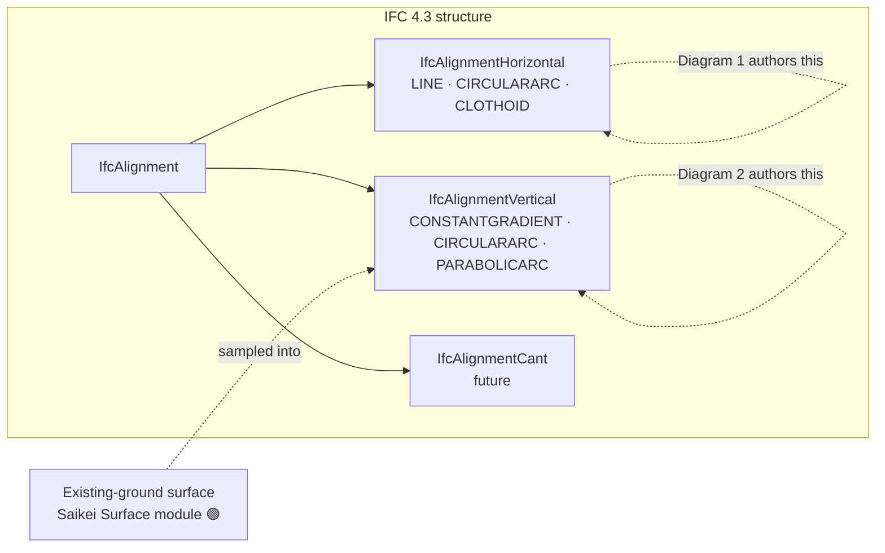

# Civil 3D — Alignment User-Flow Diagrams

> Decision-oriented user flows for **horizontal alignments** and **vertical
> alignments (profiles)** in Autodesk Civil 3D, to inform the Saikei Civil
> (Bonsai) UX. Mermaid renders in GitHub, VS Code preview, and most slide
> tools. Companion to `Civil3D_Horizontal_Alignment_FunctionMap.md`.
>
> Legend: 🟢 Saikei has it · 🟡 partial · ⬜ not yet (annotations are Saikei
> status, not Civil 3D's).

---

## 1. Horizontal Alignment — User Flow



**Saikei read on the horizontal flow:** the green spine (Layout → Tangent-
Tangent → PI editing → start station) is built. The purple branches —
constraint-based **fixed/floating/free** geometry, **spirals**, **grid
view**, **offset/widening**, **design criteria & superelevation** — are the
open frontier.

---

## 2. Vertical Alignment (Profile) — User Flow

In Civil 3D the vertical axis lives in the **Profile** subsystem. The user
first samples existing ground into a **profile view** (the station/elevation
grid), then draws a **layout (design) profile** on it. A profile **must**
reference a parent horizontal alignment.

```mermaid
flowchart TD
    Start([User wants a vertical design]) --> HasAlign{Parent horizontal<br/>alignment exists?}
    HasAlign -->|No| MakeAlign[Create horizontal alignment first<br/>see Diagram 1]
    HasAlign -->|Yes| Drop{Profile ▾ dropdown}
    MakeAlign --> Drop

    Drop -->|Sample existing ground| SurfProf[Create Surface Profile<br/>EG sampled from TIN along alignment]
    Drop -->|Design from scratch| ProfView0[Create Profile View first]
    Drop -->|Regress from data| BestFit[Create Best Fit Profile<br/>points / entities / EG]

    SurfProf --> ProfView[Create Profile View<br/>station vs. elevation grid]
    ProfView0 --> ProfView

    ProfView --> Design{Design the layout profile}
    BestFit --> Design

    Design --> Dlg[/"Create Profile – Draw New" dialog:<br/>Name · Style · Label Set ·<br/>Vertical Curve Settings (default K or length)/]
    Dlg --> Toolbar{{Profile Layout Tools toolbar}}

    Toolbar -->|Quick grade line| DT{Draw Tangents}
    DT -->|No Curves| DTnc[PVIs only — straight grades]
    DT -->|With Curves| DTwc[Auto vertical curves at PVIs<br/>crest / sag]

    Toolbar -->|Curve at a PVI| PVIc{PVI-based curve}
    PVIc -->|Parabola| Parab[Free Vertical Parabola<br/>length · K value · pass-through]
    PVIc -->|Circular| Circ[Free Circular Curve<br/>radius · pass-through]

    Toolbar -->|Curve between entities| Ent{Entity-based / constraint}
    Ent -->|Pinned| FixedV[Fixed vertical curve]
    Ent -->|1 neighbor| FloatV[Floating vertical curve]
    Ent -->|2 neighbors| FreeV[Free vertical curve<br/>parabolic / circular]

    DTnc --> Edit
    DTwc --> Edit
    Parab --> Edit
    Circ --> Edit
    FixedV --> Edit
    FloatV --> Edit
    FreeV --> Edit

    Edit{Edit & refine}
    Edit -->|Move grade breaks| PVIedit[Insert / Delete / Move PVIs<br/>grip-edit grades]
    Edit -->|Tabular values| Grid[Profile Grid View:<br/>grade · curve length · K · PVI elev]
    Edit -->|Check| Checks[Design Criteria / Design Check Set<br/>min K for speed · sight distance]
    PVIedit --> Done
    Grid --> Done
    Checks --> Done

    Done([Layout profile ready →<br/>feeds Corridor vertical control])

    classDef have fill:#1b5e20,stroke:#a5d6a7,color:#fff;
    classDef partial fill:#7c5c00,stroke:#ffe082,color:#fff;
    classDef none fill:#4a148c,stroke:#ce93d8,color:#fff;

    class HasAlign,MakeAlign,DT,DTnc,DTwc,Parab,PVIedit have;
    class SurfProf,ProfView,ProfView0,Dlg,Grid partial;
    class BestFit,Circ,FixedV,FloatV,FreeV,Ent,Checks none;
```

**Saikei read on the vertical flow:** PVI-based tangents + vertical curves
and PVI editing are **in progress** (`CIVIL_OT_add_pvi`,
`add_vertical_to_alignment`, `layout_vertical_by_pvi_method`,
`enter_pvi_edit_mode`). The pieces that make it usable for real design work
are the missing links: a **surface (existing-ground) profile** to design
against, a **profile-view grid** to draw on, a **grid/tabular editor**, and
**design checks (K-values)**. Note the hard prerequisite at the top — vertical
**requires** a parent horizontal alignment, which matches IFC 4.3's
`IfcAlignmentVertical` being a child layout of `IfcAlignment`.

---

## 3. How the two flows connect (the bit Dion will care about)



The horizontal flow (Diagram 1) authors `IfcAlignmentHorizontal`; the vertical
flow (Diagram 2) authors `IfcAlignmentVertical`. Saikei's existing **Surface
module** is exactly the existing-ground source a surface profile needs — so the
vertical flow's biggest missing piece (sample EG along the alignment) is mostly
a matter of wiring two modules you already have together.

---

## Sources
- [Profile Layout Tools (Autodesk Help)](https://help.autodesk.com/cloudhelp/2022/ENU/Civil3D-UserGuide/files/GUID-BEDDB4FF-833A-4E3C-8C41-87B6DA78AA52.htm)
- [About Creating Layout Profiles (Autodesk KB)](https://knowledge.autodesk.com/support/civil-3d/learn-explore/caas/CloudHelp/cloudhelp/2018/ENU/Civil3D-UserGuide/files/GUID-49C6EA06-84FF-4358-850C-2C462DF542C3-htm.html)
- [To Add Free Vertical Curves to a Profile (Autodesk KB)](https://knowledge.autodesk.com/support/civil-3d/learn-explore/caas/CloudHelp/cloudhelp/2019/ENU/Civil3D-UserGuide/files/GUID-092AA0AE-8219-43D4-89B4-BD126596B10D-htm.html)
- [To Change the Constraint Type of a Free Parabolic or Circular Vertical Curve (Autodesk KB)](https://knowledge.autodesk.com/support/civil-3d/learn-explore/caas/CloudHelp/cloudhelp/2018/ENU/Civil3D-UserGuide/files/GUID-1269C73E-944E-48F0-BD0C-C78BA5DC488A-htm.html)
- [Create Best Fit Profile (WisDOT C3D KB)](https://c3dkb.dot.wi.gov/Content/c3d/prfl/prfl-creat-bst-fit.htm)
- [Alignment Layout Tools (Autodesk Help)](https://help.autodesk.com/view/CIV3D/2024/ENU/?guid=GUID-1481F228-A59C-427A-A4B0-B83CA74A401E)
- [Creating Alignments (Autodesk Help)](https://help.autodesk.com/view/CIV3D/2024/ENU/?guid=GUID-9913484D-A0D8-4B2C-A62D-536E73DF368E)
