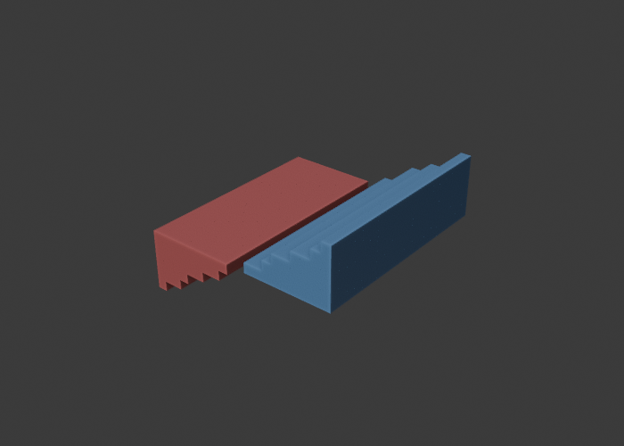
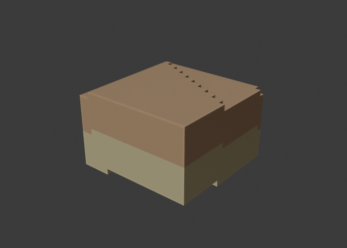
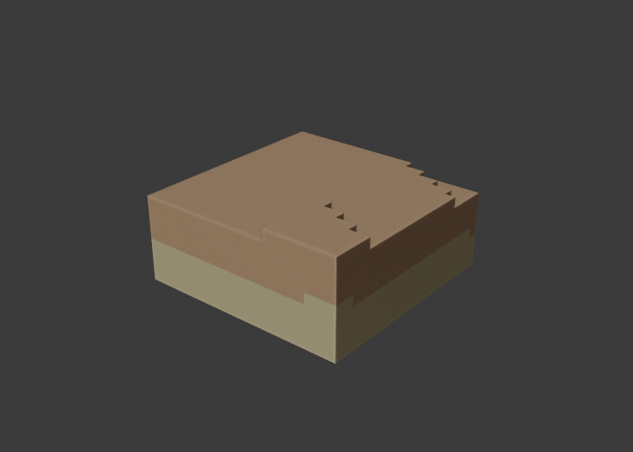

# Implementing TM27 Voxels in Bonsai / IfcOpenShell — RLE Occupancy, Benchmarks & Questions

*Saikei Civil (civil-infrastructure module for Bonsai). Prepared for the buildingSMART
Implementers Forum, following the voxels thread and TM27 / PR #1110 ([TM27] Voxels, @aothms).*

---

## TL;DR

We built a working end-to-end TM27 voxel pipeline in Bonsai/IfcOpenShell for civil
**earthwork and geomodels** — voxelizing TIN surfaces into occupancy, computing cut/fill by
set-difference, classifying stratigraphy into `IfcVoxelData` semantic layers, and authoring real
`IfcVoxelGrid` + `IfcVoxelData` into an IFC 4.4 file, with a Blender UI. A nice payoff of the
occupancy model: once strata are voxelized, **per-stratum (per-material) excavation quantities**
fall out as a masked count — "how much clay vs sand vs rock am I digging" — which is fiddly to do
with boundary solids. Three things we'd like to bring to the schema discussion:

1. **The dense occupancy mask is the binding constraint — and in at least one major toolkit it
   is currently *un-authorable*.** We could not write `Voxels : ARRAY [1:?] OF IfcBoolean` through
   IfcOpenShell at all (details below). Run-length encoding (RLE) of occupancy as integers was
   therefore not just an optimization — it was the **only** encoding that serialized.
2. **Measured compression is large and scenario-dependent:** ~34× to ~360× for terrain-bounded
   earthwork, and effectively unbounded (≈96,000× on a 16 M-cell grid) for layered geomodels,
   while a noisy contamination layer pays a bounded per-layer tax (~80–150×). All lossless.
3. **A short list of schema questions** (end of this post) we think are worth resolving before the
   IFC 4.4 NWI.

---

## 1. What we implemented

**Schema.** TM27 isn't in any released IfcOpenShell schema, so we assembled a prototype —
`IFC4x3_RC4` longform EXPRESS + the TM27 entity delta from PR #1110 — and registered it at
runtime via `ifcopenshell.express.parse()` + `ifcopenshell.register_schema()`. This authors and
round-trips real `IfcVoxelGrid` / `IfcComplementaryData` / `IfcVoxelData` (+ the five concrete
subtypes) without a native build.

**Pipeline** (mirrors the existing `ifcopenshell.api.surface` / `.earthwork` style — file-per-
function, no Blender dependency in the API layer):

```
TIN surfaces (IFC4X3 production model)
  → voxelize (cell-centre-below-surface test, optional N×N supersampling)
  → occupancy mask → RLE → IfcVoxelGrid (Body/Tessellation representation)
  → cut/fill by occupancy set-difference → Qto_Earthworks{Cut,Fill}BaseQuantities
  → semantic layers as IfcVoxelData subtypes (material code, confidence, …)
  → written to a separate IFC 4.4 "sidecar" file (production model stays IFC4X3_ADD2)
  → Blender preview UI
```

**Source-of-truth stance.** The voxel grid is a *derived/analysis* representation. The parametric
TIN / `IfcSectionedSolidHorizontal` model remains authoritative in IFC4X3; voxels live in a
separate IFC 4.4 sidecar that references the production surfaces by `GlobalId`. We deliberately
avoid mixing schemas in one file.

**Coverage.** ~108 automated tests across the math/codec, IFC authoring, and orchestration
layers, including a cut/fill result cross-validated against the analytic prism volume.

---

## 2. Encoding methods we weighed, and why we chose RLE

The occupancy mask is `O(Nx·Ny·Nz)` and dense — for a 500 m site at 0.5 m that's ~2×10⁸ tokens
(hundreds of MB serialized). We evaluated four ways to make that tractable:

| Encoding | STEP-native? | Self-contained file? | OGC CIS fit | Transparent? |
|---|---|---|---|---|
| Dense (as proposed) | yes | yes | yes | yes — but does not scale |
| **RLE (our choice)** | **yes** | **yes** | **rangeSet `dataBlock`** | **yes** |
| Octree | poorly | yes | must flatten to grid | traversal structure |
| VDB / Zarr | no (external blob) | **no** | external reference | opaque |

We chose **RLE** because it is the only option that simultaneously: (a) reuses TM27's existing
compact-list + derived-array pattern (`IfcListToExpandedArray`), now applied to the occupancy mask
itself; (b) serializes natively in STEP with no external binary references (preserving IFC's
self-contained-file principle); (c) maps directly onto the OGC Coverage Implementation Schema
`rangeSet`; and (d) stays semantically transparent (a run list is readable; an octree is a tree;
a VDB blob is opaque). Octree compresses comparably but has no native home in CIS and serializes
poorly in STEP. VDB/Zarr is the superior *technology* but only aligns with IFC as an external
referenced blob, which breaks the self-contained file.

RLE is applied **per layer** (occupancy mask and each `IfcVoxelData` payload independently), so a
homogeneous layer collapses to almost nothing while a noisy layer pays only its own, bounded cost.

---

## 3. Three findings from actually authoring TM27 in IfcOpenShell

These are the concrete, reproducible issues we hit — and the reason RLE became *necessary*:

- **F1 — `ARRAY [1:?]` resolves to UNKNOWN.** IfcOpenShell's EXPRESS parser does not resolve the
  indeterminate-bound `Voxels : ARRAY [1:?] OF IfcBoolean`; the attribute type comes back UNKNOWN.
  Declaring it as `LIST [1:?]` parses cleanly and serializes identically.
- **F2 — a list-of-boolean attribute is un-authorable.** Even with the type fixed, IfcOpenShell's
  Python wrapper has no setter *or* getter for a `LIST`/`ARRAY OF IfcBoolean` (no released IFC
  entity has such an attribute, so it was never wired). Both writing and reading the dense boolean
  occupancy mask fail. A list-of-**integer** round-trips perfectly. **So the dense TM27 occupancy
  mask cannot currently be written through IfcOpenShell at all** — RLE-as-integer (run pairs
  `[count, value, …]`, value 1 = occupied) is the only occupancy encoding that survives the
  toolchain. This is the strongest argument we have for compressed/integer occupancy.
- **F3 — standalone value-wrappers crash the registered schema.** Creating a standalone
  defined-type value (e.g. `file.create_entity("IfcIdentifier", …)` for a property `NominalValue`)
  produces an access violation under the runtime-registered schema. Direct attribute assignment
  (which auto-wraps) is safe — so we author quantities and metadata via direct attributes, not
  property-set value wrappers. (This is an IfcOpenShell-side issue, noted for implementers.)

---

## 4. Benchmark results (measured, lossless)

Generated with our harness against the real codec + real IFC 4.4 authoring; seeded/reproducible.
The **dense** column is *projected* STEP byte cost (one token per cell) because the dense form is
un-authorable per F2 — so RLE is both smaller **and** the only thing that serializes.

| Scenario | Grid | Cells | Occ. runs | Occ. ratio | Dense (proj.) | RLE file | File vs dense | Encode | Lossless |
|---|---|--:|--:|--:|--:|--:|--:|--:|:--:|
| Terrain-bounded | 100×100×20 | 200 K | 2,920 | 34× | 0.6 MB | 15 KB | 40× | 1 ms | ✓ |
| Terrain-bounded | 500×500×50 | 12.5 M | 36,002 | 174× | 37.5 MB | 193 KB | 194× | 83 ms | ✓ |
| Terrain-bounded | 1000×1000×80 | **80 M** | 115,130 | **347×** | **240 MB** | **668 KB** | **359×** | 885 ms | ✓ |
| Geomodel (stratum) | 200×200×100 | 4 M | 1 | 2,000,000× | 52 MB | 2.1 KB | 24,821× | 14 ms | ✓ |
| Geomodel (stratum) | 400×400×100 | **16 M** | 1 | — | **208 MB** | **2.2 KB** | **96,207×** | 124 ms | ✓ |
| Noisy contamination | 200×200×100 | 4 M | 1 | — | 28 MB | 59 KB | 477× | 15 ms | ✓ |

**Per-layer semantic payloads** (the `IfcVoxelData` story):

| Scenario | Grid | Layer | Type | Values | Runs | Ratio |
|---|---|---|---|--:|--:|--:|
| Geomodel | 400×400×100 | MaterialCode | integer | 16 M | 5 | 1,600,000× |
| Geomodel | 400×400×100 | Confidence | real | 16 M | 61 | 131,148× |
| Noisy | 200×200×100 | ContaminationPpm | integer | 4 M | 13,493 | 148× |

Reading: terrain-bounded earthwork compresses on long uniform runs (soil below / air above) and
improves with grid size; a homogeneous material/stratum layer collapses to ~one run per stratum
boundary regardless of resolution; a noisy field pays a real but bounded per-layer cost — i.e.
RLE is a per-layer cost, not a uniform tax.

---

## 5. It works in the tool

All three views below are the actual operators driving the full authoring stack, rendered headless
from the Blender module (new **CIVIL → Voxel Earthwork** tab).

**Cut / fill.** Existing ground vs a tilted design grade at 0.5 m. Red = cut (excavation), blue =
fill (embankment); volumes report in the panel (cut 77.5 / fill 72.5 / net −5.0 m³).



**Geomodel / strata.** A stack of boundary surfaces (ordered by elevation) classified into stratum
voxels — ochre clay over sand — with per-stratum volumes in the panel. Material is stored as an
integer-coded `IfcIntegerVoxelData` layer (RLE) plus a code→material legend.



**Per-stratum excavation (the payoff).** Intersecting the cut region with the stratum
classification on a shared lattice splits the excavation by native material — here digging from
z8 down to z4 yields **Clay 202.0 m³ + Sand 200.6 m³**, the cut region colored by material. In the
occupancy model this is one boolean-AND + count; with boundary solids it would mean clipping each
cut prism against each stratum solid.



---

## 6. Additional implementation work worth noting

- **Vectorized RLE codec.** A numpy run-length encode/decode so the occupancy/payload encoding
  scales to 10⁸ cells in well under a second (the naive per-element path took minutes). Encode of
  the 80 M-cell grid above is ~0.9 s.
- **Voxelization from TINs.** Cell-centre-below-surface rasterization with optional N×N XY
  supersampling (majority vote) to reduce stair-step bias on boundary cells, reusing the surface
  module's STRtree-accelerated point-in-TIN interpolation.
- **Cut/fill as counting, not calculus.** Set-difference of two occupancy states on a shared
  lattice — overhangs and disconnected pockets need no special handling. Cross-validated against
  the analytic prism volume (exact on cell-aligned geometry; provably converges as cell size
  shrinks).
- **Quantities + shrink/swell** written into the standard `Qto_Earthworks*BaseQuantities`
  (Undisturbed/Compacted/Loose volumes).
- **Geomodels + per-stratum excavation.** Stratum classification from a stack of boundary
  surfaces → an integer-coded RLE `IfcIntegerVoxelData` layer on an `IfcGeomodel`, with
  `stratum_volume` queries. Intersecting the cut region with that layer gives excavation quantities
  by material — a masked count, validated to sum back to the total cut.

---

## 7. Standards alignment (brief)

The domain/range ("where" / "what") split appears in three standards, which makes alignment
natural rather than forced:

| | "where" | "what" |
|---|---|---|
| IFC 4.4 / TM27 | `IfcVoxelGrid` | `IfcVoxelData` (one per field) |
| OGC CIS | `domainSet` | `rangeSet` + `rangeType` |
| Khronos glTF (3D Tiles 2.0) | `EXT_primitive_voxels` grid | `EXT_structural_metadata` property attributes |

TM27's one-attribute-per-layer maps 1:1 onto both CIS bands and glTF property attributes. Our read
is that **IFC-RLE is the archival/self-contained source of truth, and 3D Tiles 2.0 / glTF is the
streaming delivery counterpart** (dense-per-tile + octree LOD) — complementary stages of one
pipeline, not competitors. (3D Tiles 2.0 voxels are shipping in geotech already, e.g.
bedrock.engineer and swisstopo via CesiumJS — but none emit IFC-native voxels, which is the gap
TM27 fills.)

---

## 8. Questions for the schema authors

1. **Compressed occupancy.** Given the dense mask is the dominant file-size driver *and*
   currently un-authorable through IfcOpenShell (F2), is there appetite to bless a compressed
   occupancy encoding in TM27 — e.g. an `Encoding` enum (`DENSE` | `RLE`) on `IfcVoxelGrid` /
   `IfcVoxelData`, with the list interpreted as `(count, value)` run pairs when `RLE`?
2. **`Voxels` type.** Would you reconsider `ARRAY [1:?] OF IfcBoolean`? The indeterminate-bound
   `ARRAY` is awkward for at least one parser (F1), and boolean aggregates have poor toolkit
   support (F2). Options: `LIST` instead of `ARRAY`; a bounded `ARRAY`; or integer/logical-coded
   occupancy.
3. **Expansion function.** Extend `IfcListToExpandedArray` with a mode argument, or add a sibling
   `IfcRunLengthToExpandedArray`? And can we fix one run-pair ordering convention —
   `(count, value)` vs `(value, count)`?
4. **Boolean vs fractional occupancy.** Should TM27 permit a fractional-occupancy layer (0–1 per
   boundary cell) for sub-cell earthwork accuracy, or keep occupancy strictly boolean and push
   fractions to an `IfcRealVoxelData` payload?
5. **Placement / georeferencing.** Can we confirm `IfcVoxelGrid` composes cleanly with
   `IfcLinearPlacement` for corridor-aligned geotechnical grids, and that X/Y/Z map unambiguously
   to the host placement axes? (The grid carries no placement of its own.)
6. **`VoxelSize*` measure.** `IfcNonNegativeLengthMeasure` admits zero (degenerate zero-thickness
   voxel). Should this be `IfcPositiveLengthMeasure`?
7. **`IfcComplementaryData` / TM20 overlap.** What's the intended resolution of the shared
   supertype between TM27 and TM20? It affects how observation/payload data is modeled generally.
8. **CIS / glTF mapping.** Is there interest in a canonical, documented mapping (TM27 ↔ CIS
   `rangeSet` ↔ glTF `EXT_structural_metadata`) so a voxel coverage can round-trip
   IFC ↔ OGC ↔ 3D Tiles?
9. **Voxel geomodels vs solid strata.** For a layered ground model we author one `IfcGeomodel`
   with a single stratum-classification `IfcVoxelData` layer (the voxel idiom), rather than N
   separate `IfcSolidStratum` / `IfcGeotechnicalStratum` solids. Is that the intended TM27 pattern
   for geotech, and how should the code→material legend be carried (we currently use a small
   convention on `Description`, since Pset value-wrappers crash the prototype schema per F3)?

---

*Implementation: `ifcopenshell.api.voxel` + Bonsai `tool/core/ui` voxel module. Schema prototype is
`IFC4x3_RC4` + TM27 delta, runtime-registered; pinned to PR #1110. Happy to share code, the
benchmark harness, or test files. — Michael Yoder, Desert Springs Civil Engineering / Saikei Civil.*
